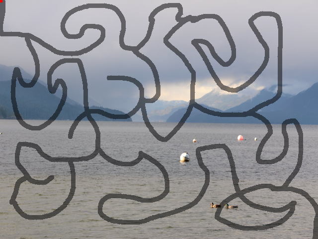

# TreasureMap Decoder

## Description
- draws the entire maze on a copy of the base image by darkening the locations
  so it's visible as a shadow. This can be done by iterating over every 
  pixel, but it will be faster to begin from the start position 
  and find the points in the maze from there. Returns an image whose 
  non-maze pixels are the same as the base image, and whose maze pixels 
  have colour values that are 50% of those in the base image, for each of 
  red, green and blue.

  